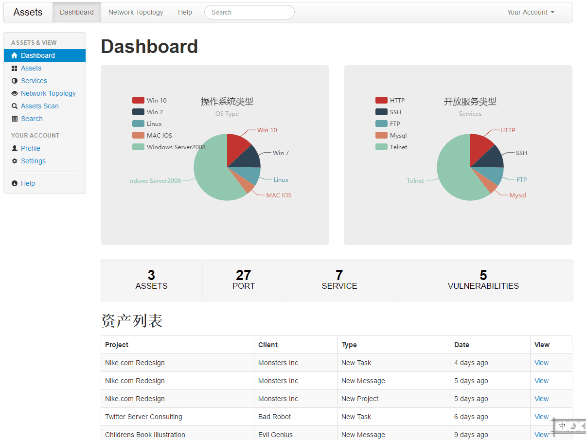
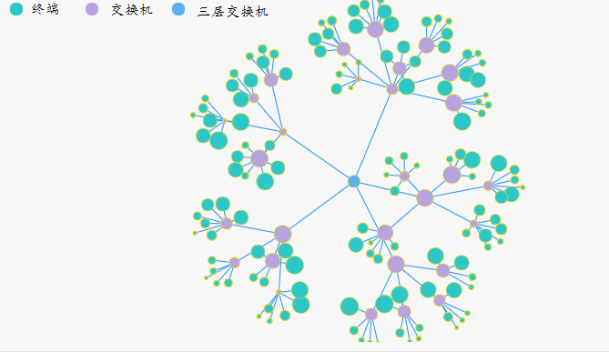
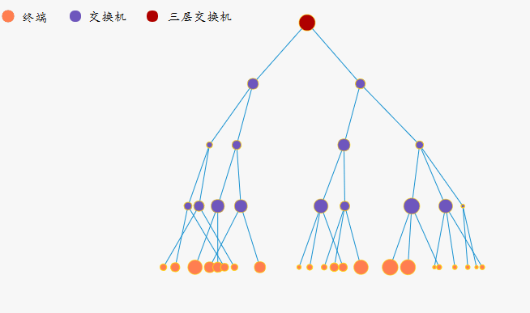

#Visualization asset security management system.

------

>VASMS是一个Linux平台下基于C和PHP的可视化资产安全管理系统！

>Author: [Hardy] [Cryin]

###程序功能：

* 自动发现内部网络拓扑结构;
* 在浏览器中完美展示网络拓扑结构;
* 基于SNMP协议的资产类型识别;
* 资产信息扫描，包括发现资产，识别资产开放端口及对应服务，以及运行的操作系统类型;
* 当前资产安全漏洞汇总及明细查询;

###运行环境:
> php 5.x + mysql

###BUG反馈:

>目前所有功能尚未完全开发完成，欢迎多提意见。^_^

###关于作者

* Hardy https://hardyguo.github.io/
* Cryin https://cryin.github.io/ 

###安装方法:

><TODO>

###Screenshot
控制面板:

网络拓扑结构：

网络拓扑结构：

###更新说明:

>2016/11/10 提交部分功能代码
>2016/11/11 更新README

>...

